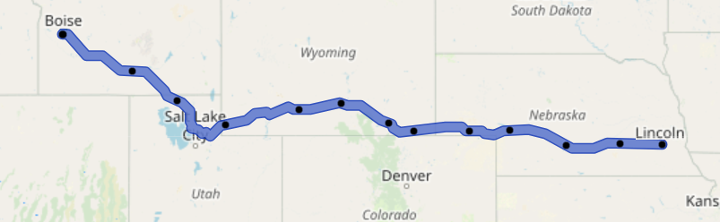

<h1 align="center">
  <br>
  
  <br>
  WiperCheck
  <br>
</h1>
<h4 align="center">An API that analyzes your road trip and returns weather conditions along your journey.</h4>
<br/>


`GET /journey?from=charlotte north carolina&to=ford field detroit`


    { 
       "summary": [
           { 
               "location": "Charlotte, North Carolina", 
               "conditions": "Heavy intensity rain", 
               "precipChance": 100 
           }, 
           {   
               "location": "Charleston, West Virginia", 
               "conditions": "Light rain", 
               "precipChance": 59 
           },
           { 
               "location": "Athens, Ohio", 
               "conditions": "Overcast clouds", 
               "precipChance": 2 
           },
           { 
               "location": "Taylor, Michigan",
               "conditions": "Overcast clouds",
               "precipChance": 0 
           } 
       ],
       "detailedSteps": [...]
    }


## About The Project

WiperCheck is a REST-based service written in Go that analyzes your trip route and determines the chance of rain or snow throughout your journey. There is also an optional loader component for caching forecasted weather data to improve performance.

### Built With
* [![Go][go-shield]][go-url]
* [![Redis][redis-shield]][redis-url]
* [![AWS][aws-shield]][aws-url]

## How It Works
WiperCheck leverages multiple external data sources to determine weather conditions for your trip:
- [PositionStack](https://positionstack.com/) to geocode the addresses entered
- [OSRM](https://project-osrm.org/) to retrieve routing coordinates/durations for the trip
- [OpenWeather](https://openweathermap.org/) for forecasted weather data

Using the trip route returned by OSRM, the service retrieves forecasted weather information along each step of the route.



The routing response includes the estimated duration between route steps, allowing us to query for weather data at the precise time the user will be in each area.


## Request Structure

`GET /journey?from=toronto&to=detroit&delay=20&minPop=15`

`from`: Where your trip begins

`to`: Where you're headed

`delay`: (optional) How long until you plan on beginning your trip, in minutes

`minPop`: (optional) Only return weather data with chances of precipitation above this value.

## Response Structure
The service response includes a `summary` with high-level information as well as `detailedSteps` with more granular details, perhaps for use by a front-end.

    { 
       "summary": [
           { 
               "location": "Charlotte, North Carolina", 
               "conditions": "Heavy intensity rain", 
               "precipChance": 100 
           },
           { 
               "location": "Charleston, West Virginia", 
               "conditions": "Light rain", 
               "precipChance": 59 
           },
           ...
       ],
       "detailedSteps": [
           { 
               "name": "I 77 Express Lanes",
               "stepDuration": 4287, 
               "totalDuration": 5390,
               "coordinates": {
                   "latitude": 36.263004,
                   "longitude": -80.824535
               },
               "weather": { 
                   "precipChance": 0,
                   "conditions": {
                       "id": 804,
                       "main": "Clouds",
                       "description": "overcast clouds",
                       "iconURL": "http://openweathermap.org/img/wn/04n@2x.png"
               },
               "location": {
                   "number": "525",
                   "street": "Samaritans Ridge Ct",  
                   "locality": "State Road",
                   "region": "North Carolina",
                   "country": "United States"
               }      
           },
           ...
       ]
    }

`stepDuration`: how long the step listed will take on the journey

`totalDuration`: duration of trip up until this step

`conditions.id`: OpenWeather ID for the weather conditions - [list](https://openweathermap.org/weather-conditions#Weather-Condition-Codes-2)


## Getting Started
For deploying to AWS, see [wipercheck-infra](https://github.com/evanhutnik/wipercheck-infra). The below steps are for local development.

### Prerequisites
* Go 1.17 or later
* (optional) A redis cluster for caching forecasted weather data using [wipercheck-loader](https://github.com/evanhutnik/wipercheck-infra)

### Installation

1. Clone the repo
   ```sh
   git clone https://github.com/evanhutnik/wipercheck-service.git
   ```
2. Get API keys for [PositionStack](https://positionstack.com/product) and [OpenWeather](https://home.openweathermap.org/users/sign_up)
3. Add file named `.env` to root of project with the following fields:
```sh
   osrm_baseurl=http://router.project-osrm.org/route/v1/driving  
   openweather_apikey={api key}
   openweather_baseurl=https://api.openweathermap.org/data/2.5/onecall  
   positionstack_apikey={api key}  
   positionstack_baseurl=http://api.positionstack.com/v1  
   disable_redis={true/false}  
   redis_address={redis url (optional)}
   ```
4. Build the service
   ```sh
   go build -o ./bin/wipercheck-service ./cmd/service/main.go
   ```
5. Run executable
   ```sh
   ./bin/wipercheck-service
   ```
## Acknowledgments
* [DALL-E](https://openai.com/blog/dall-e/) for generating the WiperCheck logo
* [Will](https://github.com/whutchinson98) for helping with the CDK code

[go-shield]: https://img.shields.io/badge/Go-00ADD8?style=for-the-badge&logo=go&logoColor=white
[go-url]: https://go.dev/
[redis-shield]: https://img.shields.io/badge/redis-%23DD0031.svg?&style=for-the-badge&logo=redis&logoColor=white
[redis-url]: https://redis.io/
[aws-shield]: https://img.shields.io/badge/Amazon_AWS-232F3E?style=for-the-badge&logo=amazon-aws&logoColor=white
[aws-url]: https://aws.amazon.com/
